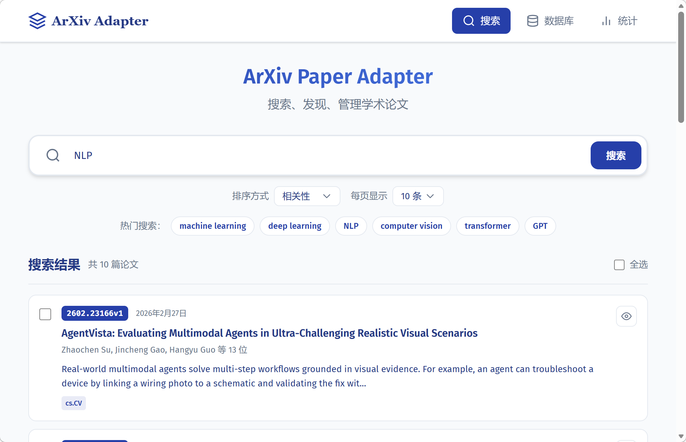
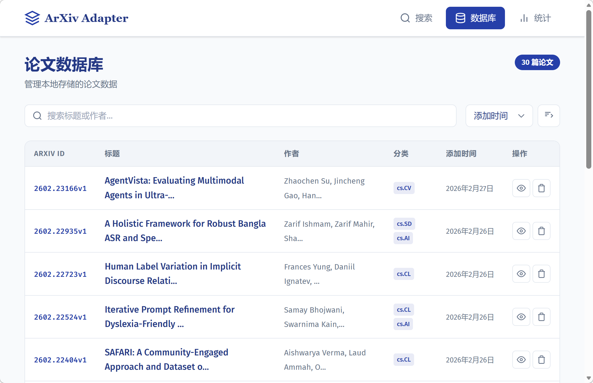
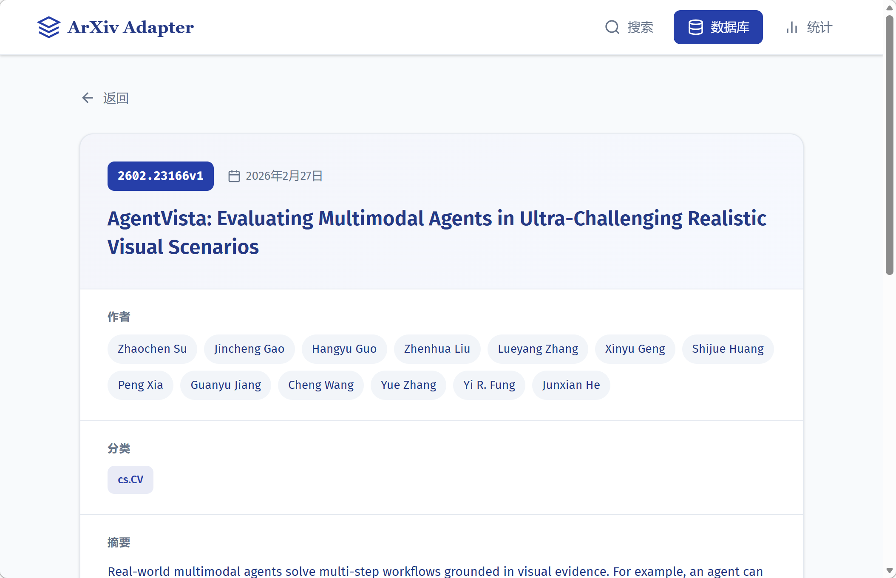
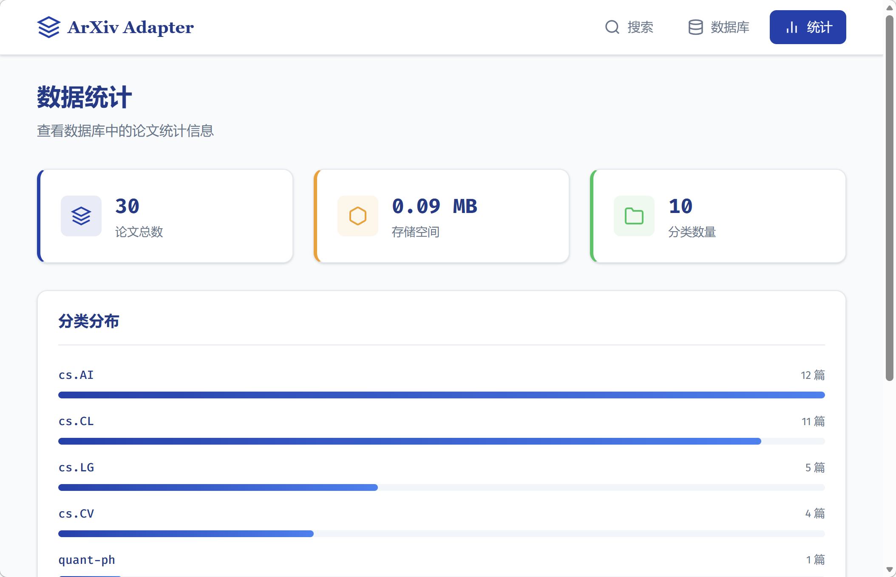

# ArXiv Paper Adapter

[](https://www.python.org/downloads/)
[](https://fastapi.tiangolo.com/)
[](https://vuejs.org/)
[](LICENSE)

轻量封装 arxiv.py/feedparser，统一「单篇 / 批量 / 订阅」采集接口，配备现代化 Web 管理界面。



## 功能特性

### 核心库
- 统一采集接口：单篇、批量搜索、RSS 订阅
- 论文去重：基于 arxiv_id + version
- 版本管理：保留所有版本历史
- 元数据标准化：适配 AI 处理场景
- ArXiv 合规请求：内置请求间隔控制
- 可选存储：SQLite 或内存存储模式

### Web 界面
- 现代化 UI 设计，响应式布局
- 实时搜索与预览
- 批量操作支持
- 数据可视化统计

## 安装

```bash
# 克隆项目
git clone https://github.com/Lhy723/paper-arxiv-adapter.git
cd paper-arxiv-adapter

# 安装依赖
uv sync

# 安装前端依赖
cd web/frontend && npm install
```

## 快速开始

### 方式一：开发模式（推荐）

```bash
# Windows
python dev.py

# 或分别启动
# 终端 1 - 后端
cd web/backend && uv run uvicorn main:app --reload

# 终端 2 - 前端
cd web/frontend && npm run dev
```

访问 http://localhost:5173（支持热更新）

### 方式二：生产模式

```bash
# 构建前端
cd web/frontend && npm run build

# 启动后端
cd web/backend && uv run uvicorn main:app
```

访问 http://localhost:8000

## 截图预览

### 搜索页面

*搜索 ArXiv 论文，支持排序、预览、选择性保存*

### 数据库页面

*表格展示本地论文，支持排序、分页、搜索过滤*

### 详情页面

*完整论文信息展示，包含摘要、作者、分类等*

### 统计页面

*论文数量、存储空间、分类分布统计*

## 核心库使用

```python
from paper_arxiv_adapter import ArxivAdapter, SQLiteBackend, MemoryBackend

# 使用 SQLite 存储
adapter = ArxivAdapter(storage=SQLiteBackend("papers.db"))

# 或使用内存存储
adapter = ArxivAdapter(storage=MemoryBackend())

# 单篇采集
paper = adapter.fetch("2301.07041v2")
print(paper.title, paper.authors)

# 批量搜索
papers = adapter.search("machine learning", max_results=10)

# RSS 订阅
def on_new_paper(paper):
    print(f"New paper: {paper.title}")

adapter.subscribe(category="cs.AI", on_new=on_new_paper)

# 获取版本历史
versions = adapter.get_versions("2301.07041")
```

## API 接口

| 方法 | 路径 | 说明 |
|------|------|------|
| GET | `/api/papers` | 获取论文列表（支持排序、分页） |
| GET | `/api/papers/{id}` | 获取单篇论文详情 |
| DELETE | `/api/papers/{id}` | 删除论文 |
| POST | `/api/papers/batch-save` | 批量保存论文 |
| POST | `/api/search` | 搜索 ArXiv 论文 |
| POST | `/api/subscribe` | 订阅分类更新 |
| GET | `/api/stats` | 获取统计数据 |

API 文档：
- Swagger UI: http://localhost:8000/docs
- ReDoc: http://localhost:8000/redoc

## 项目结构

```
paper-arxiv-adapter/
├── src/paper_arxiv_adapter/    # 核心库
│   ├── adapter.py              # 适配器
│   ├── models.py               # 数据模型
│   ├── storage.py              # 存储层
│   └── compliance.py           # 合规请求
├── web/
│   ├── backend/                # FastAPI 后端
│   │   └── main.py
│   └── frontend/               # Vue 3 前端
│       └── src/
│           ├── views/          # 页面组件
│           └── components/     # 通用组件
├── docs/
│   └── screenshots/            # 截图文件
├── tests/                      # 测试文件
├── dev.py                      # 开发启动脚本
└── pyproject.toml
```

## 技术栈

| 类别 | 技术 |
|------|------|
| 后端 | Python 3.13+, FastAPI, arxiv.py, feedparser |
| 前端 | Vue 3, TypeScript, Vite |
| 存储 | SQLite |
| 包管理 | uv, npm |

## 贡献

欢迎提交 Issue 和 Pull Request！

## 开源协议

[MIT License](LICENSE) © Lhy723
